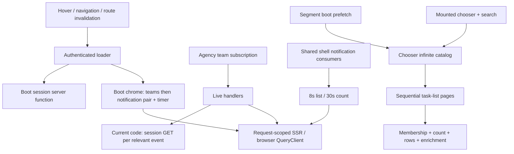

# Fix Railway hot paths

This is an implementation plan. Updating it does not implement or deploy the fixes. Keep Railway's current memory allocation and preserve the full task chooser, server-persisted timer, and shared Agency/Canvas shell behavior.

## Evidence and confidence

The original investigation reported the following for project **Internal Tools**, environment **Orch**, service **web**, at https://brainiac.school-of-marketing.com:

| Original observation                                                                            | What it establishes                                                                              |
| ----------------------------------------------------------------------------------------------- | ------------------------------------------------------------------------------------------------ |
| Memory 944 MB / 1,024 MB; CPU about 2%; HTTP p95 420–476 ms; zero 5xx                           | Resource/latency snapshot, not proof of saturation, a leak, or event-loop blocking               |
| Postgres cache hit 99.99%, 33 MB database, low CPU                                              | Little evidence of disk pressure; does not exclude expensive SQL, lock waits, or pool contention |
| `projectTasks/list` 7.2 s; unread count 3.9 s; projects list 3.5 s / 112 KB; active timer 3.5 s | Individual slow requests; these values are not endpoint p95s                                     |
| Notification list about every 8 s; bursts of session GETs                                       | Candidate request amplification; identify initiators before assigning all traffic to navigation  |
| Notification preferences 61 s / 499                                                             | Client-aborted request to investigate separately; not a completed 61 s response                  |
| Long-lived `/rpc/ws`; ordinary network flows                                                    | Exclude WebSocket lifetime from RPC latency comparisons                                          |

These numbers are retained from the original plan and were **not refreshed during this plan revision**. The source did not record an exact UTC interval or deployment ID. Re-capture those before claiming improvement. Production Sentry availability must also be checked at execution time; this worktree already contains separate, uncommitted Sentry/router/auth changes.

Current source review confirms:

- `notifications-queries.ts` uses ungated warm polling for list (8 s) and cold polling for count (30 s).
- `agency-live-handlers.ts` calls `authClient.getSession()` for each timer and notification event. This is another session request source beyond loaders and window focus.
- `_authenticated.tsx` directly calls boot server functions and unconditionally seeds query caches. Boot chrome chooses the first team and turns a partial RPC failure into empty notification/timer fallbacks.
- Chooser `nextPageParam` reads **`lastPage.total`**, although the displayed total uses `pages[0].total`. The API validates `total` as a required nonnegative integer on **every** page.
- `listAgencyProjectTasks` executes count, row selection, and enrichment. Correlated conditions depend on filters; the ordinary catalog count is not inherently a correlated-subquery count. `buildProjectTaskRecord` maps records without per-row DB queries.

## Runtime and ownership



Relevant boundaries, all under existing feature owners:

| Concern                             | Files                                                                                                                                                                             |
| ----------------------------------- | --------------------------------------------------------------------------------------------------------------------------------------------------------------------------------- |
| Notification cache and UI consumers | `apps/web/src/features/notifications/notifications-queries.ts`, `hooks/use-featured-rail-notification.ts`, `notifications-queries.test.ts`                                        |
| Polling and connection lifecycle    | `apps/web/src/features/shared/agency-query-options.ts`, `live/agency-live-connection.ts`, `live/agency-live-connected.ts`, `live/agency-live-handlers.ts`                         |
| Server notification delivery        | `packages/api/src/routers/notifications/service.ts`, `live-bridge.ts`; `packages/api/src/routers/agency-ops/live/live.ts`                                                         |
| Auth and shell boot                 | `apps/web/src/routes/_authenticated.tsx`, `lib/session-boot.ts`, `lib/boot-prefetch.ts`, `lib/auth-client.ts`, `lib/auth-session.ts`, `providers/auth-provider.tsx`, `router.tsx` |
| Chooser and cache lifecycle         | `apps/web/src/features/shared/agency-task-chooser-catalog.ts`, `agency-queries.ts`, `agency-segment-boot.ts`, `agency-query-cache.ts`, `stores/agency-ops.ts`                     |
| Task-list API                       | `packages/api/src/routers/agency-ops/tasks/router.ts`, `service.ts`, `task-list-search.ts`; `shared/task-helpers.ts`                                                              |

## 1. Establish a reproducible baseline

Before implementation, record commit/worktree state, exact Railway deployment and replica, UTC interval, browser/version, route, team task count, page size, and number of tabs. Preserve unrelated dirty work, especially the current instrumentation and auth/router edits.

Use a browser network trace with request initiators and an exportable request summary. DevTools MCP is optional: use the repository's available Playwright/browser tooling if needed. Measure:

1. Cold authenticated Tracker load, including SSR-internal RPCs that will not appear as separate browser requests.
2. Two minutes idle with a confirmed active team subscription.
3. Ten sidebar hovers and ten in-shell navigations within 30 seconds, then navigation after the freshness window.
4. Forced WS loss while HTTP remains available, reconnect, Agency → Canvas → Agency, and two concurrent tabs.
5. Catalog sizes 0, 1, 100, 101, and 250+ tasks; measure first usable chooser time and complete hydration separately.

Capture endpoint request counts, bytes, errors/aborts, and p50/p95 with sample counts. Separate boot, scheduled polling, focus, mutation, and live-event recovery requests. Save sanitized evidence in `docs/investigations/railway-hot-paths/` with baseline and treatment sections; exclude cookies, credentials, notification bodies, and private task content.

For task-list latency, time membership checks, count, row query, enrichment, and serialization separately using available instrumentation or a local benchmark. Use a realistic local database and read-only `EXPLAIN (ANALYZE, BUFFERS)` with a bounded statement timeout. A slow HTTP request alone does not justify a count rewrite or index.

## 2. Remove session requests from live-event processing

Use the existing authenticated session owner to supply the current viewer ID to the live handler boundary. Timer/notification event processing must not fetch a session to identify the viewer.

- Identity must be available for the first live event, update on account change, and clear on sign-out. Drop events when identity is unavailable; reconcile after authenticated subscription startup.
- Keep recipient/user filtering and verify `event.teamId` against the subscribed team. Discard async work from a superseded identity or subscription generation.
- Do not introduce a permanent module-level cached user or shared SSR identity. Preserve one ref-counted connection per team.
- Test event bursts, other recipients, logout during processing, and sign-in as another user. With a settled session, 100 timer/notification events should add **zero session HTTP requests**.

## 3. Reduce notification polling without relying on lossless live delivery

Do not ship only `{ liveGated: true, teamId }`. Existing live delivery is incomplete as a source of truth:

- Created events also represent coalesced updates to an existing notification. The current list deduplicates IDs but unread/action counts still increment; the existing test even asserts this drift.
- Seen/read/read-all writes do not publish corresponding live changes, so another tab/device still needs reconciliation.
- The live server caps a slow subscriber's queue at 50 events and has no durable replay cursor.
- The subscription currently mounts in `agency-page.tsx`; a global notification consumer on Canvas must retain its fallback.

Recommended policy for this bounded fix:

| State                                               | List interval                  | Count interval                 |
| --------------------------------------------------- | ------------------------------ | ------------------------------ |
| Confirmed live subscription for this team           | 30 s reconciliation            | 30 s reconciliation            |
| Connecting, reconnecting, error, or no subscription | Existing 8 s fallback          | Existing 30 s fallback         |
| Hidden tab                                          | No background interval polling | No background interval polling |

This removes the 8-second connected list loop while accepting up to 30 seconds for remote read-state changes. Keep explicit mutation refreshes and focus recovery. Completely stopping connected reconciliation requires a separate reliable read-state/missed-event design and is not the default here.

Implementation requirements:

1. Express the connected reconciliation interval as an opt-in policy in the shared query helper; preserve other queries' existing behavior. Use the same policy for all observers of each notification key.
2. Make mounted observers react to live-state changes. `refreshAgencyLiveGatedPolling` currently calls `query.setOptions`; prove that observer timers actually change with the installed TanStack Query version. Prefer reactive hook options over relying on internal query-option mutation.
3. On initial subscription and reconnect, coalesce one refresh of each active notification query to recover the HTTP-fetch/subscription gap. On teardown, resume fallback even when the shell consumer remains mounted on Canvas. A WS reconnect is distinct from browser network reconnect.
4. Make created/coalesced cache updates idempotent by ID/version. Compute count deltas only from known previous state; when a truncated/missing list makes the delta unknowable, schedule a coalesced authoritative count fetch. Never derive global totals from the limited list or initialize an unknown total as though zero were authoritative.
5. Reconcile failed seen/read mutations so a failed dismissal does not permanently hide a notification. Preserve app-update priority and all existing rail/inbox actions.

Test real mounted observers with controlled time, not just returned option objects. Cover duplicate delivery, seen → unseen coalescing, older events, reconnect with a missed event, read in a second tab, team switch, Canvas teardown, and multiple consumers sharing a key.

## 4. Bound authenticated loader work safely

Measure loader invocations with `cause` and `preload` before changing freshness. Installed router-core already defaults preload freshness to 30 seconds; regular reload also depends on entry, changed match identity, or forced revalidation. Missing route `staleTime` alone does **not** prove every child navigation/hover reruns this parent.

If the baseline demonstrates repeated stale parent loads, use route-local `staleTime: 30_000` and explicit `preloadStaleTime: 30_000`, after the lifecycle safeguards below. If it does not, retain the current route policy and attribute savings to the verified request sources. Keep global intent preloading and child-route freshness policies unchanged. Route freshness is elapsed-time reuse checked on a loading trigger, not an automatic timer that refetches after 30 seconds. `beforeLoad` remains a separate lifecycle concern. See [TanStack loading](https://tanstack.com/router/latest/docs/guide/data-loading) and [preloading](https://tanstack.com/router/latest/docs/guide/preloading).

Safeguards required in the same change:

- Fix `resolveAuthSession` fallback semantics: the loader user may bridge initial pending hydration, but must not override an authoritative signed-out client result. Distinguish loading/transient failure from signed-out instead of creating redirect loops.
- Clear/invalidate both authenticated router data and user-scoped query/store/live state on sign-out or account replacement. A fresh cached parent route must never restore the previous user's shell on Back or rapid sign-in.
- Keep boot session checks request-scoped on SSR and keep all API authorization checks. No global server session/chrome cache.
- Seed only successful boot results. A failed unread/list/timer fetch must not become authoritative zero/empty/null data or erase newer live/mutation-confirmed state. Handle the three chrome RPC results independently and avoid overwriting a query updated after boot began.
- Preserve the selected team on client navigation. First-team selection is an initial fallback, not permission to reseed another team's chrome on every reload.
- Test direct deep links, legacy redirects and search params, hard refresh, no-team accounts, expired/revoked sessions, transient auth failure, sign-out in another tab, and account/team changes within 30 seconds.

**Keep Better Auth focus refetch initially.** Cookie caching reduces server lookup cost; it does not eliminate HTTP requests or make the loader the sole session owner. Only consider `sessionOptions.refetchOnWindowFocus: false` in a later measured change with an explicit expiry/revocation refresh path. See [Better Auth session refetching](https://better-auth.com/docs/concepts/client).

## 5. Make chooser hydration reusable and keep pagination correct

Preserve prefetch-before-open, automatic complete catalog hydration, nested client/project/task search, existing-task preference, selected-task resolution, and the absence of a Load more gate.

### Cache and drain behavior

- Use shared query options for prefetch and mounted catalog consumers so their keys, page params, and freshness cannot diverge. Keep the key suffix **`infinite`, then `catalog`/`search`** and `{ pages, pageParams }` cache shape.
- Target **120 s catalog staleTime**; keep server search freshness at **15 s**. Longer freshness is for the catalog, not a blanket shared constant change.
- Gate the longer TTL on tested server-confirmed task create/update/delete and project/client rename/archive/trash/restore cache refreshes. Include other-tab live updates and an explicit focus/reconnect reconciliation path; document the remaining remote-change freshness bound. If any path lacks coverage, retain 15 s until that path is fixed.
- Drain only enabled, current-team/current-search queries, with one next-page request at a time. Stop on errors or cancellation; do not turn an errored page into an effect-driven retry loop. Old searches must stop draining when superseded.
- Audit `fetchInfiniteQuery({ pages: 1 })` during a stale prefetch against an already hydrated cache. Reopening/navigating must not truncate cached pages and cause repeated full drains or rail flicker.
- Restrict `keepPreviousData` to the same authorized team; previous-team items must never appear while a new team loads. Deduplicate task IDs when merging pages and selected-task cache records.

### API contract and measured SQL work

**Do not implement the original “skip COUNT after page 1” change.** The current contract is:

```ts
// Existing contract, retained for all list callers.
type TaskListPage = {
  items: AgencyProjectTask[];
  page: number;
  pageSize: number;
  total: number; // exact server-computed total for this request's filters
};
```

The server cannot reuse a previous response's total without a new protocol. Returning zero, omitting the field, or trusting a client-provided total would break consumers or make totals misleading. Done-by-member lists also use completion-count totals, so totals are not universally the number of returned task records.

1. Inventory all list callers, including ordinary paginated lists, My Tasks, journey discovery, catalog, and search.
2. Retain count on every page in this pass. Optimize only stages demonstrated expensive by baseline: count/query shape, supporting indexes, or batch enrichment. Do not blindly parallelize SQL if pool contention is the bottleneck. Any index needs query-plan evidence and a reviewed migration; no production schema changes during diagnosis.
3. Preserve membership checks, per-member completion semantics, rate inheritance, tracked seconds, search filters, soft-deleted-project exclusion, and team-wide archived-client exclusion. Explicit project queries currently allow archived-client tasks; preserve that distinction.
4. Add a unique task-ID tie-breaker after `createdAt` for deterministic offset pagination. Keep refreshes authoritative under concurrent edits; deterministic sorting alone does not provide snapshot consistency.
5. If count remains a demonstrated dominant cost after request reductions, make a **separate follow-up** for a dedicated cursor-based chooser scan with `nextCursor` and no exact-total promise. Keep ordinary `list` unchanged, share authorization/filter ownership, and adapt every chooser cache patch deliberately. Do not silently change this plan's public contract to reach a latency target.

## Design choice and tradeoffs

Two complete approaches were considered:

- **Preserve contracts and reduce repeated work** — selected. Reuse existing query/session owners, retain exact pagination totals and bounded notification reconciliation, then optimize measured SQL. This exposes fewer new cache/protocol states and can be verified in independent changes.
- **Build new boot/catalog snapshots and fully event-driven notifications** — deferred. It could remove more calls but requires versioned snapshots, exact invalidation, notification read-state propagation, and replay/recovery semantics. That is a larger consistency project than these hot-path fixes justify.

Accepted costs are occasional reconciliation requests, retained count queries until evidence warrants a new API, and browser catalog memory for complete hydration. No claim that fewer requests must materially reduce the replica's steady-state RSS.

## Verification and acceptance

Use the same scenarios and dataset as baseline. Functional correctness gates performance claims.

| Scenario                                       | Acceptance                                                                                                                                                                                                     |
| ---------------------------------------------- | -------------------------------------------------------------------------------------------------------------------------------------------------------------------------------------------------------------- |
| Live idle for 120 s, no focus/mutations/events | No 8 s list loop; at most 4 scheduled list and 4 scheduled count reconciliations after initial settlement                                                                                                      |
| WS loss while HTTP works                       | Mounted list/count observers restore 8 s / 30 s fallback without a remount; reconnect performs one coalesced recovery per key                                                                                  |
| Authenticated navigation within 30 s           | No repeated parent boot fanout after its initial settled load; child-route requests remain allowed and separately counted                                                                                      |
| Settled live event burst                       | Zero session HTTP requests attributable to the 100-event burst; correct viewer filtering and timer reconciliation                                                                                              |
| Chooser reopen / navigation within 120 s       | Once fully hydrated and absent mutations/recovery triggers, zero catalog page requests; every task remains available                                                                                           |
| Catalog boundary fixtures                      | 0/1/100/101/250+ items terminate correctly, have no missing/duplicate IDs, and retain exact pagination behavior                                                                                                |
| Notification mutations and duplicates          | No count drift, stale dismissed cards, or persistent optimistic success after a failed write                                                                                                                   |
| Sign-out/account/team switch                   | No cached prior identity or previous-team catalog/chrome; server auth and redirects remain correct                                                                                                             |
| Task-list benchmark                            | Report page-1 and later-page p50/p95 separately, count/full-drain cost and sample size; target at least 30% lower full-drain time if SQL changes are made, otherwise report request-reduction gains separately |
| Railway after release                          | No new 5xx/OOM/restart pattern; compare HTTP p95 and memory under comparable traffic, with WS excluded                                                                                                         |

Do not claim endpoint p95 from a handful of slow-log examples. If fewer than 100 comparable requests are available, label the sample limited and extend observation. Treat an unexplained >10% p95 regression as an investigation/rollback trigger, not noise to hide behind aggregate request reductions.

Implementation checks:

- Extend focused Bun tests around notification cache/observer behavior, auth-session resolution, live connection/handlers, chooser boundaries, and `agency-query-cache.test.ts`. Add service integration coverage for any actual SQL change using an isolated test database.
- Run affected test files from their package directory so aliases/environment match existing tests; include existing task-list filter/search and chooser search/group/keyboard regressions.
- Run `bunx turbo run check-types --force`, `bun run check:conventions`, `bun run check:realtime`, and `bun run check:golden`.
- Use read-only lint/format checks (`bunx oxlint` and `bunx oxfmt --check <touched-files>`). Root `bun run check` runs repository-wide `oxfmt --write`; avoid rewriting unrelated dirty files during verification.
- Verify a production-like web build and authenticated browser scenarios, including both Agency and Canvas. Record pre-existing failures separately; passing compilation alone does not establish request reduction.

## Delivery, observation, and rollback

Keep implementation changes reviewable by concern: live identity; notification lifecycle/cache; auth lifecycle/boot caching; catalog lifecycle; measured SQL. No commits, deploys, or infrastructure changes are implied by this plan-edit request.

After deployment is authorized, resolve the Railway project/environment/service IDs and track the **exact deployment** to `SUCCESS`. Capture bounded HTTP/runtime logs and resource metrics for a comparable window; use explicit service/environment scope and check the installed CLI's flags. Keep the original memory limit unchanged.

Record baseline → treatment request counts, bytes, first-usable/full-catalog timings, endpoint distributions, errors, and RSS in the investigation artifact. Revert the responsible change if auth identity leaks/sticks, notifications fail to recover, catalog hydration loses tasks, timer state regresses, or latency/errors materially worsen. Keep dependent correctness fixes together when rolling back a freshness/polling policy.

Out of scope: Railway plan/memory changes, broad observability rollout or sample-rate edits, PostHog, global preload removal, timer persistence redesign, and a speculative `projects/list` payload rewrite. If request amplification falls but memory or slow RPCs remain, document the next measured bottleneck rather than declare the incident solved.
