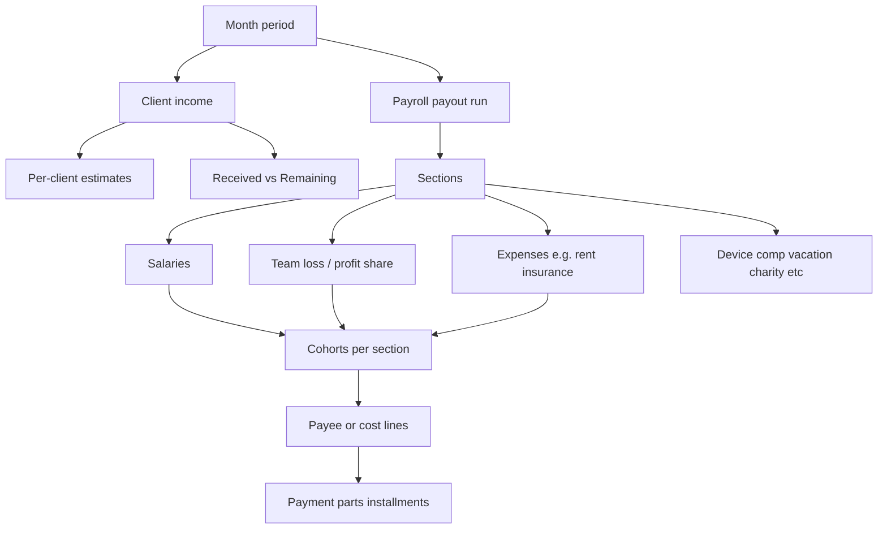
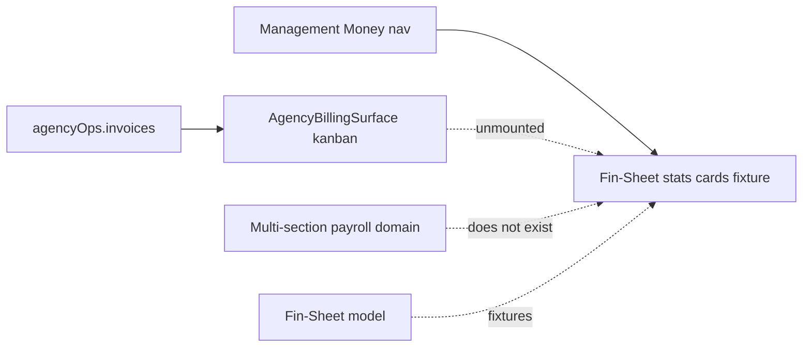

# Management Money UI Implementation Plan

> **Living plan.** Update this file as parts ship or scope shifts. Open Design gallery was **discarded** (2026-08-04); product UI is built directly, part by part.
>
> **For agentic workers:** Follow golden-file layers. Check off steps with `- [x]` as they land. Prefer smallest shippable UI slices over big-bang.

**Goal:** Ship Agency Management **Money** (`manage=money`) as a dual money surface: **client AR** (money in) and **payroll payout runs** (money out), matching the Fin-Sheet mental model — sections, cohorts, and partial payments.

**Architecture:** Golden-file feature under `apps/web/src/features/` (billing / money domain). Views are props-only; hooks own ViewModels; fixtures first where APIs do not exist yet; mount from [`agency-management-surface.tsx`](../../../apps/web/src/features/settings/agency-management-surface.tsx). Reuse existing client invoice oRPC where possible; payroll is greenfield (schema/API later).

**Tech Stack:** React 19 + Vite, TanStack Query + oRPC (client AR), shadcn primitives, Bun checks.

---

## Locked product framing

- **Surface:** Agency Management Commercial pane `manage=money` — Fin-Sheet **stats cards** live (fixture); detail jump-offs stubbed. Legacy `manage=invoices` / `billing` redirect to `money`.
- **Money in — Client invoices:** Existing domain (DB/API + unwired [`AgencyBillingSurface`](../../../apps/web/src/features/billing/)). Lifecycle `draft → sent → (partial) → paid`. Fin-Sheet tracks Estimated / Received / Remaining.
- **Money out — Payroll payout run (not salaries-only):** A monthly **run** contains multiple **sections**. Each section has **cohorts** it applies to. Line amounts can be paid in **parts** (due / paid / remaining).
- **Domain reference:** [`artifacts/Fin-Sheet.csv`](../../../artifacts/Fin-Sheet.csv).
- **Missing artifact:** Individual **member monthly payment** sheet is not in the repo. Use stand-in per-member lines until provided; then update fixtures + this plan.
- **Out of scope (for now):** PDF/email, Polar SaaS billing, Open Design gallery. Management **Rates** pane removed (member rates stay on People).
- **Visual constraint:** Orch Management chrome. **shadcn theme tokens**. No liquid-glass, no purple-glow, no new custom brand tokens. Prefer existing Agency UI classes (`agencySectionTitleClass`, etc.).

## Fin-Sheet → product model

| Fin-Sheet row                             | Maps to                                        |
| ----------------------------------------- | ---------------------------------------------- |
| Estimated Income By Client + Total Income | Client invoices / billed                       |
| Received / Remaining                      | Partial client collections                     |
| Salaries                                  | Payroll section: Salaries                      |
| Expensis                                  | Payroll section(s): Rent, Insurance, ops costs |
| Debt / Discount                           | Adjustments section                            |
| Device Compensation                       | Comp section                                   |
| 200H Paid Vacation                        | Leave/comp section                             |
| Profit share / Loss share (+ Team Profit) | **Team loss** / profit-share section           |
| Charity, PBC, PAC                         | Optional period close / distribution sections  |

### Domain rules

1. **Sections** — A run is a list of named buckets (Salaries, Team loss, Rent, Insurance, …). Extensible later.
2. **Cohorts** — Every section declares which cohorts it applies to (e.g. Core FT, Contractors, Office). Lines nest under cohort within section.
3. **Partial payments** — Client invoices and payout lines show **due / paid / remaining** (and optional installment schedule). Status includes Partial / Paying, not only Paid.
4. **Lifecycle** — Client: `draft → sent → (partial) → paid`. Run: `draft → approved → paying → paid` (paid when all section remainings = 0).

## Current gap

## Starting IA (pragmatic — evolve in this plan)

Stats cards first (scoreboard + metric jump-offs). Dual Clients | Payroll and deeper run UI come later. Brief: [`docs/superpowers/specs/2026-08-04-money-stats-cards-design.md`](../specs/2026-08-04-money-stats-cards-design.md).

---

## Status snapshot (2026-08-04)

| Part | Slice                                           | Status   | Notes                                  |
| ---- | ----------------------------------------------- | -------- | -------------------------------------- |
| 0    | Export living plan to repo                      | **Done** | Renamed Invoices → Money               |
| R    | Rename pane/files to Money; strip shell UI      | **Done** | `manage=money`                         |
| S    | Fin-Sheet stats cards (4 panels, jump-offs)     | **Done** | Fixture + period chooser               |
| B    | Bills filterable empty section                  | **Done** | Polished instrument panel; no rows yet |
| E    | Expenses card (upcoming + recent)               | **Done** | Polished companion to Bills            |
| 1    | Money shell + segments + mount                  | Reset    | Superseded by stats-first IA for now   |
| 2    | Mount client invoice kanban                     | Pending  | `AgencyBillingSurface` still unmounted |
| 3    | Period summary strip (Fin-Sheet KPIs)           | **Done** | Delivered as four stats cards          |
| 4    | Payroll run shell (month, status, section list) | Pending  | Fixture                                |
| 5    | Section detail: cohorts + payee lines           | Pending  | Metric jump-off / bill row targets     |
| 6    | Partial payout parts (due/paid/remaining UI)    | Pending  | Fixture mutations                      |
| 7    | Client partial collections UI                   | Pending  | May need API/schema                    |
| 8    | Wire payroll schema + API + replace fixtures    | Pending  | Backend phase                          |
| 9    | Member monthly sheet when provided              | Blocked  | Artifact missing                       |

**Ship readiness:** Money shows stats cards, period chooser, and polished Bills instrument (segmented party + quiet status + ghost empty).

---

## File map (target — grow as parts land)

| File                                                                          | Responsibility                                    |
| ----------------------------------------------------------------------------- | ------------------------------------------------- |
| `docs/superpowers/plans/2026-08-04-management-money-ui.md`                    | This living plan                                  |
| `docs/superpowers/specs/2026-08-04-money-stats-cards-design.md`               | Stats cards design brief                          |
| `apps/web/src/features/shared/agency-management-sections.ts`                  | Pane id `money`, label + subtitle                 |
| `apps/web/src/features/settings/agency-management-surface.tsx`                | Mounts `AgencyMoneySurface` for money             |
| `apps/web/src/features/billing/agency-money-surface.tsx`                      | Public export → container                         |
| `apps/web/src/features/billing/containers/agency-money-surface-container.tsx` | One hook, one view                                |
| `apps/web/src/features/billing/hooks/use-agency-money-surface.ts`             | Tenure active month + fixtures + select stub      |
| `apps/web/src/features/billing/agency-money-surface-view.tsx`                 | Title, period, stats cards, Bills filters + empty |
| `apps/web/src/features/billing/money-stats-fixtures.ts`                       | Fin-Sheet-shaped fixture amounts                  |
| `apps/web/src/features/billing/money-bills-filters.ts`                        | Party/status filters + empty copy                 |
| `apps/web/src/features/billing/money-bills-filters.test.ts`                   | Empty-copy composition checks                     |
| `docs/superpowers/specs/2026-08-05-money-bills-section-design.md`             | Bills section design brief                        |
| `apps/web/src/features/billing/agency-billing-surface*.tsx`                   | Existing client kanban (reuse later)              |
| `packages/db` / `packages/api`                                                | Payroll + partials — **later** (Part 8)           |

**Folder choice:** `features/billing/` + `agency-money-surface*` (golden `billing` domain).

---

## Global constraints

- Golden-file: `view ← container ← hook ← (store/fixtures/oRPC)`. Views never call oRPC/stores.
- Bun only: `bun run check` · `bun run check-types` · `bun run check:conventions` · `bun run check:golden` when adding in-scope files.
- Actor identity only from session on API work (Part 8+).
- UI-first parts may use **fixtures** in the hook; mark fixture boundaries clearly so Part 8 can swap them.
- Do not redesign People / Resourcing.
- Keep Management rail + top bar chrome unchanged.

---

### Part 0: Export plan — DONE

- [x] Write living plan under `docs/superpowers/plans/`
- [x] Note OD gallery discarded; product UI is the path
- [x] Carry Fin-Sheet model, sections/cohorts/partials, missing member sheet

---

### Rename: Invoices → Money — DONE

- [x] Pane id `money`, label **Money**, wallet icon
- [x] Legacy `manage=invoices` / `billing` → `money`
- [x] Delete temporary Invoices shell files (tabs + kanban mount)

---

### Stats cards (Fin-Sheet scoreboard) — DONE

Brief: [`2026-08-04-money-stats-cards-design.md`](../specs/2026-08-04-money-stats-cards-design.md)

- [x] Four cards: Income & cash flow · Deductions & expenses · Profitability · Additional allocations
- [x] Tenure active month period label
- [x] Metric-row jump-offs (`onSelectMetric` stub)
- [x] Fixture amounts in `money-stats-fixtures.ts`
- [x] Mount `AgencyMoneySurface` on Management Money

---

### Part 1: Money shell + dual segments + mount — RESET

Superseded for now by stats-first IA.

---

### Part 2: Clients = existing billing kanban — RESET

`AgencyBillingSurface` remains in tree; remount under Money Clients when Part 1 returns.

---

### Part 3: Period summary strip

**Goal:** Thin KPI strip: Billed · Received · Remaining · Payable remaining (fixtures).

**Steps:**

- [ ] Extend ViewModel with period KPIs
- [ ] Presentational strip using Agency metric classes
- [ ] Document fixture source

---

### Part 4: Payroll run shell

**Goal:** Payroll segment shows current month run: status badge, section list with due/paid/remaining.

---

### Part 5: Section detail — cohorts + lines

**Goal:** Selected section shows cohorts and payee/cost lines.

---

### Part 6: Partial payout parts UI

**Goal:** Installment parts on a line/section (due / paid / remaining), fixture mutation.

---

### Part 7: Client partial collections UI

**Goal:** Received / Remaining on client invoices. Spike schema first.

---

### Part 8: Backend — payroll + replace fixtures

**Goal:** Durable payroll runs/sections/cohorts/parts + optional invoice payments.

---

### Part 9: Member monthly payment sheet

**Blocked** until artifact is provided.

---

## Changelog

| Date       | Change                                                                                     |
| ---------- | ------------------------------------------------------------------------------------------ |
| 2026-08-04 | OD gallery plan abandoned; living product UI plan exported                                 |
| 2026-08-04 | Part 1–2 Invoices shell built under `features/billing/`                                    |
| 2026-08-04 | **Rename Invoices → Money**; delete shell UI; title-only reset; plan renamed               |
| 2026-08-04 | Remove Management Rates pane + `agency-settings-rates-pane*` files; `manage=rates` → Money |
| 2026-08-04 | Money subtitle: "Client invoices, payroll, and cash in one place."                         |
| 2026-08-04 | Craft: Fin-Sheet stats cards on Money (fixture, tenure active month, metric jump-offs)     |
| 2026-08-04 | Polish Money stats: hero metrics, cash composition bar, bento income card, period badge    |
| 2026-08-04 | Money period: Dashboard `RangePresetChooser` + custom date inputs (replaces static badge)  |
| 2026-08-05 | Craft: Bills empty section — party rail + status chips + composed empty copy               |
| 2026-08-05 | Polish Bills: instrument panel, segmented party, quiet status + Clear, ghost list preview  |
| 2026-08-05 | Craft: Expenses card beside Bills — Upcoming subscriptions + Recent empty groups           |
| 2026-08-05 | Polish Expenses: differentiated groups, ghost lists, count labels, shared list preview     |
| 2026-08-05 | Expenses +: add dialog (name, one-time/subscription+period, optional note); local rows     |
| 2026-08-05 | Replace Additional allocations with Cohort allocations card (rules + calc options)         |
| 2026-08-05 | Polish Cohort allocations: Rules/Formulas tabs, cohort chips, metric-card hierarchy        |
| 2026-08-05 | Restore Additional allocations card; cohort/formulas → Money settings tabbed dialog        |
