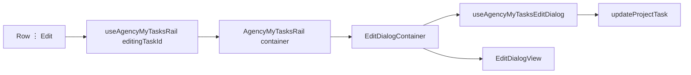

# My Tasks Edit Dialog Implementation Plan

> **For agentic workers:** REQUIRED SUB-SKILL: Use superpowers:subagent-driven-development (recommended) or superpowers:executing-plans to implement this plan task-by-task. Steps use checkbox (`- [ ]`) syntax for tracking.
>
> **Also persist** this plan to [`docs/superpowers/plans/2026-08-11-my-tasks-edit-dialog.md`](docs/superpowers/plans/2026-08-11-my-tasks-edit-dialog.md) at the start of execution (copy from this plan).

**Goal:** Let Tracker users edit an existing My Tasks row (title, assignees, estimate) via ⋮ → Edit, saving through the existing `updateProjectTask` path.

**Architecture:** Mirror Reports entry-details: rail owns `editingTaskId`; a dedicated edit-dialog hook/container/view mounts as a sibling from the rail container. Pure draft helpers get TDD coverage. Project is shown read-only (API cannot move tasks across projects).

**Tech Stack:** React 19, shadcn Dialog, existing `AgencyMemberChooser` + `AgencyMyTasksEstimatePopover`, Zustand `updateProjectTask`, Bun test.

## Global Constraints

- Confirmed shape: fields = quick-add parity where writable; open = ⋮ → Edit; row click/Enter/Delete unchanged.
- **Project is read-only** — `updateAgencyProjectTask` / `UpdateProjectTaskPayload` have no `projectId`; do not invent move-task API in this plan.
- Prefer existing task over create (unchanged); no clear-X on choosers; estimate optional (`null` or 1–1440).
- Golden-file: views props-only; one hook per container; no oRPC/stores in views.
- Update remains owner-scoped (same as Delete) — no permission change.
- Bun only: `bun test`, `bun run check`, `bun run check-types`, `bun run check:conventions`, `bun run check:golden` when adding files.
- Operate mode: reuse create-dialog / rail chrome (Dialog `sm:max-w-md`, primary Save, ghost Cancel).

## Shape brief (locked)

| Item      | Decision                                                                                         |
| --------- | ------------------------------------------------------------------------------------------------ |
| Open      | ⋮ menu item **Edit** above Delete                                                                |
| Editable  | Title, assignees (multi / team), estimate                                                        |
| Read-only | Project label (`Project name` or `Project · Client` from rail project lookup)                    |
| Save      | `updateProjectTask({ teamId, taskId, title, assignedToTeam, assigneeUserIds, estimateMinutes })` |
| Close     | Cancel, Esc, overlay — discard draft                                                             |
| Untouched | Play, complete, filters, mini-timer, quick-add composer, time-tracking WIP                       |



## File map

| File                                                                                                                                                                                       | Responsibility                         |
| ------------------------------------------------------------------------------------------------------------------------------------------------------------------------------------------ | -------------------------------------- |
| [`apps/web/src/features/task-management/agency-my-tasks-edit-draft.ts`](apps/web/src/features/task-management/agency-my-tasks-edit-draft.ts)                                               | Pure draft from task, dirty, canSave   |
| [`apps/web/src/features/task-management/agency-my-tasks-edit-draft.test.ts`](apps/web/src/features/task-management/agency-my-tasks-edit-draft.test.ts)                                     | Unit tests                             |
| [`apps/web/src/features/task-management/hooks/use-agency-my-tasks-edit-dialog.ts`](apps/web/src/features/task-management/hooks/use-agency-my-tasks-edit-dialog.ts)                         | Draft state, submit, ViewModel         |
| [`apps/web/src/features/task-management/containers/agency-my-tasks-edit-dialog-container.tsx`](apps/web/src/features/task-management/containers/agency-my-tasks-edit-dialog-container.tsx) | One hook → view                        |
| [`apps/web/src/features/task-management/my-tasks-rail/agency-my-tasks-edit-dialog-view.tsx`](apps/web/src/features/task-management/my-tasks-rail/agency-my-tasks-edit-dialog-view.tsx)     | Presentational Dialog                  |
| [`apps/web/src/features/task-management/my-tasks-rail/agency-my-tasks-edit-dialog.tsx`](apps/web/src/features/task-management/my-tasks-rail/agency-my-tasks-edit-dialog.tsx)               | Public re-export of container          |
| Modify rail hook/row/view/container                                                                                                                                                        | Open state + Edit menu + mount dialog  |
| Modify [`packages/api/.../tasks/service.ts`](packages/api/src/routers/agency-ops/tasks/service.ts)                                                                                         | Publish live on title/estimate updates |
| [`docs/golden-file-source-inventory.md`](docs/golden-file-source-inventory.md)                                                                                                             | Via `check:golden`                     |

---

### Task 1: Publish live updates for title/estimate

**Files:**

- Modify: [`packages/api/src/routers/agency-ops/tasks/service.ts`](packages/api/src/routers/agency-ops/tasks/service.ts) (~831–837)

**Interfaces:**

- Consumes: `publishAgencyTaskUpdated`
- Produces: live `task.updated` also when title or estimate changes

- [ ] **Step 1: Widen publish condition**

Change the gate after `buildProjectTaskRecord` so title/estimate updates notify peers (today only status/assignees publish):

```typescript
if (
  input.status !== undefined ||
  input.assigneeUserIds !== undefined ||
  input.assignedToTeam !== undefined ||
  input.title !== undefined ||
  input.estimateMinutes !== undefined
) {
  await publishAgencyTaskUpdated(input.teamId, task);
}
```

- [ ] **Step 2: Commit**

```bash
git add packages/api/src/routers/agency-ops/tasks/service.ts
git commit -m "$(cat <<'EOF'
fix(api): publish task.updated when title or estimate changes

EOF
)"
```

---

### Task 2: Pure edit-draft helpers (TDD)

**Files:**

- Create: `apps/web/src/features/task-management/agency-my-tasks-edit-draft.ts`
- Create: `apps/web/src/features/task-management/agency-my-tasks-edit-draft.test.ts`

**Interfaces:**

- Produces:
  - `MyTasksEditDraft = { title: string; assignedToTeam: boolean; assigneeUserIds: string[]; estimateMinutes: number | null }`
  - `myTasksEditDraftFromTask(task: { title: string; assignedToTeam: boolean; assignees: { userId: string }[]; estimateMinutes?: number | null }): MyTasksEditDraft`
  - `isMyTasksEditDraftDirty(baseline: MyTasksEditDraft, draft: MyTasksEditDraft): boolean`
  - `canSaveMyTasksEdit(args: { draft: MyTasksEditDraft; baseline: MyTasksEditDraft; pending: boolean }): boolean`

- [ ] **Step 1: Write failing tests**

```typescript
import { describe, expect, test } from "bun:test";
import {
  canSaveMyTasksEdit,
  isMyTasksEditDraftDirty,
  myTasksEditDraftFromTask,
} from "./agency-my-tasks-edit-draft";

const task = {
  title: "Loyal Rev",
  assignedToTeam: false,
  assignees: [{ userId: "u2" }, { userId: "u1" }],
  estimateMinutes: 60,
};

describe("myTasksEditDraftFromTask", () => {
  test("copies fields and sorts assignee ids", () => {
    expect(myTasksEditDraftFromTask(task)).toEqual({
      title: "Loyal Rev",
      assignedToTeam: false,
      assigneeUserIds: ["u1", "u2"],
      estimateMinutes: 60,
    });
  });

  test("nulls missing estimate", () => {
    expect(myTasksEditDraftFromTask({ ...task, estimateMinutes: undefined }).estimateMinutes).toBe(
      null,
    );
  });
});

describe("isMyTasksEditDraftDirty", () => {
  const baseline = myTasksEditDraftFromTask(task);

  test("false when equal ignoring assignee order", () => {
    expect(
      isMyTasksEditDraftDirty(baseline, {
        ...baseline,
        assigneeUserIds: ["u2", "u1"],
      }),
    ).toBe(false);
  });

  test("true when title, assignees, team flag, or estimate change", () => {
    expect(isMyTasksEditDraftDirty(baseline, { ...baseline, title: "Other" })).toBe(true);
    expect(isMyTasksEditDraftDirty(baseline, { ...baseline, estimateMinutes: null })).toBe(true);
    expect(isMyTasksEditDraftDirty(baseline, { ...baseline, assignedToTeam: true })).toBe(true);
    expect(isMyTasksEditDraftDirty(baseline, { ...baseline, assigneeUserIds: ["u1"] })).toBe(true);
  });
});

describe("canSaveMyTasksEdit", () => {
  const baseline = myTasksEditDraftFromTask(task);

  test("requires trimmed title, dirty, and not pending", () => {
    expect(
      canSaveMyTasksEdit({
        baseline,
        draft: { ...baseline, title: "Loyal Rev 2" },
        pending: false,
      }),
    ).toBe(true);
    expect(
      canSaveMyTasksEdit({ baseline, draft: { ...baseline, title: "  " }, pending: false }),
    ).toBe(false);
    expect(
      canSaveMyTasksEdit({
        baseline,
        draft: { ...baseline, title: "Loyal Rev 2" },
        pending: true,
      }),
    ).toBe(false);
    expect(canSaveMyTasksEdit({ baseline, draft: baseline, pending: false })).toBe(false);
  });
});
```

- [ ] **Step 2: Run tests — expect FAIL**

```bash
bun test apps/web/src/features/task-management/agency-my-tasks-edit-draft.test.ts
```

Expected: module not found / fail.

- [ ] **Step 3: Minimal implementation**

```typescript
export type MyTasksEditDraft = {
  title: string;
  assignedToTeam: boolean;
  assigneeUserIds: string[];
  estimateMinutes: number | null;
};

function sortedIds(ids: string[]): string[] {
  return [...ids].sort();
}

export function myTasksEditDraftFromTask(task: {
  title: string;
  assignedToTeam: boolean;
  assignees: { userId: string }[];
  estimateMinutes?: number | null;
}): MyTasksEditDraft {
  return {
    title: task.title,
    assignedToTeam: task.assignedToTeam,
    assigneeUserIds: sortedIds(task.assignees.map((a) => a.userId)),
    estimateMinutes: task.estimateMinutes ?? null,
  };
}

export function isMyTasksEditDraftDirty(
  baseline: MyTasksEditDraft,
  draft: MyTasksEditDraft,
): boolean {
  if (baseline.title.trim() !== draft.title.trim()) return true;
  if (baseline.assignedToTeam !== draft.assignedToTeam) return true;
  if (baseline.estimateMinutes !== draft.estimateMinutes) return true;
  const a = sortedIds(baseline.assigneeUserIds).join("\0");
  const b = sortedIds(draft.assigneeUserIds).join("\0");
  return a !== b;
}

export function canSaveMyTasksEdit(args: {
  draft: MyTasksEditDraft;
  baseline: MyTasksEditDraft;
  pending: boolean;
}): boolean {
  if (args.pending) return false;
  if (!args.draft.title.trim()) return false;
  return isMyTasksEditDraftDirty(args.baseline, args.draft);
}
```

- [ ] **Step 4: Run tests — expect PASS**

```bash
bun test apps/web/src/features/task-management/agency-my-tasks-edit-draft.test.ts
```

- [ ] **Step 5: Commit**

```bash
git add apps/web/src/features/task-management/agency-my-tasks-edit-draft.ts \
  apps/web/src/features/task-management/agency-my-tasks-edit-draft.test.ts
git commit -m "$(cat <<'EOF'
feat(task-management): add My Tasks edit draft dirty/canSave helpers

EOF
)"
```

---

### Task 3: Edit dialog hook + view + container

**Files:**

- Create: `hooks/use-agency-my-tasks-edit-dialog.ts`
- Create: `my-tasks-rail/agency-my-tasks-edit-dialog-view.tsx`
- Create: `containers/agency-my-tasks-edit-dialog-container.tsx`
- Create: `my-tasks-rail/agency-my-tasks-edit-dialog.tsx` (re-export)

**Interfaces:**

- Consumes: `MyTasksEditDraft` helpers, `useAgencyOpsStore.updateProjectTask`, `pendingTaskIds`, `AgencyMemberChooser`, `AgencyMyTasksEstimatePopover`, team members list from props
- Produces `AgencyMyTasksEditDialogViewModel` used by the view

- [ ] **Step 1: Hook**

```typescript
// use-agency-my-tasks-edit-dialog.ts — shape
export type UseAgencyMyTasksEditDialogOptions = {
  open: boolean;
  onOpenChange: (open: boolean) => void;
  teamId: string;
  task: AgencyProjectTask;
  projectLabel: string;
  members: AgencyMemberChooserMember[]; // same type rail already uses
};

// On open+task.id change: reset baseline+draft via myTasksEditDraftFromTask(task)
// pending = pendingTaskIds.includes(task.id)
// canSubmit = canSaveMyTasksEdit({ draft, baseline, pending })
// handleSubmit: preventDefault → updateProjectTask({ teamId, taskId, title: trim, assignedToTeam, assigneeUserIds: assignedToTeam ? [] : ids, estimateMinutes }) → onOpenChange(false) on success
// Surface update errors via try/catch local editError string (store already toasts)
```

Wire assignees like rail composer (`assignedToTeam` clears ids; selecting members clears team flag).

- [ ] **Step 2: View**

Follow [`agency-task-create-dialog-view.tsx`](apps/web/src/features/time-tracking/agency-task-create-dialog-view.tsx):

- Title: `Edit task`
- Body: title `Input`; row with `AgencyMemberChooser` (multiple, stack); read-only project text (`text-sm text-muted-foreground`); `AgencyMyTasksEstimatePopover`
- Footer: Cancel (ghost) + Save (primary, `disabled={!canSubmit}`)
- `showCloseButton={!pending}`; disable inputs when pending
- Props only — no stores

- [ ] **Step 3: Container + public re-export**

Match [`agency-task-create-dialog-container.tsx`](apps/web/src/features/time-tracking/containers/agency-task-create-dialog-container.tsx) / reports dialog pattern.

- [ ] **Step 4: Conventions + types**

```bash
bun run check:conventions
bun run check-types
bun run check:golden
```

- [ ] **Step 5: Commit**

```bash
git add apps/web/src/features/task-management/hooks/use-agency-my-tasks-edit-dialog.ts \
  apps/web/src/features/task-management/my-tasks-rail/agency-my-tasks-edit-dialog-view.tsx \
  apps/web/src/features/task-management/containers/agency-my-tasks-edit-dialog-container.tsx \
  apps/web/src/features/task-management/my-tasks-rail/agency-my-tasks-edit-dialog.tsx \
  docs/golden-file-source-inventory.md
git commit -m "$(cat <<'EOF'
feat(task-management): add My Tasks edit dialog hook, view, container

EOF
)"
```

---

### Task 4: Wire ⋮ Edit + mount dialog from rail

**Files:**

- Modify: [`use-agency-my-tasks-rail.ts`](apps/web/src/features/task-management/hooks/use-agency-my-tasks-rail.ts)
- Modify: [`agency-my-tasks-rail-row-view.tsx`](apps/web/src/features/task-management/my-tasks-rail/agency-my-tasks-rail-row-view.tsx)
- Modify: [`agency-my-tasks-rail-row.tsx`](apps/web/src/features/task-management/my-tasks-rail/agency-my-tasks-rail-row.tsx)
- Modify: [`agency-my-tasks-rail-container.tsx`](apps/web/src/features/task-management/containers/agency-my-tasks-rail-container.tsx)

**Interfaces:**

- Rail VM adds: `editingTaskId: string | null`, `onEditTask(taskId: string)`, `onEditOpenChange(open: boolean)`
- Row view adds `onEdit: () => void` → menu item **Edit** (non-destructive) above Delete

- [ ] **Step 1: Rail hook state**

```typescript
const [editingTaskId, setEditingTaskId] = useState<string | null>(null);
function onEditTask(taskId: string) {
  setEditingTaskId(taskId);
}
function onEditOpenChange(open: boolean) {
  if (!open) setEditingTaskId(null);
}
// expose editingTask = tasks.find(t => t.id === editingTaskId) ?? null
```

- [ ] **Step 2: Menu Edit item**

```tsx
<DropdownMenuItem disabled={pending} onClick={onEdit}>
  Edit
</DropdownMenuItem>
<DropdownMenuItem variant="destructive" disabled={pending} onClick={onDelete}>
  Delete
</DropdownMenuItem>
```

- [ ] **Step 3: Mount dialog in rail container** (sibling pattern from reports surface):

```tsx
return (
  <>
    <AgencyMyTasksRailView view={view} renderList={renderList} />
    {view.editingTask ? (
      <AgencyMyTasksEditDialog
        open
        onOpenChange={view.onEditOpenChange}
        teamId={view.teamId}
        task={view.editingTask}
        projectLabel={/* project?.name + optional client from view.projects */}
        members={view.members}
      />
    ) : null}
  </>
);
```

Build `projectLabel` from `view.projects.find(p => p.id === editingTask.projectId)` — use `name` only if client name is not on that project type; if clientName exists, format `` `${name} · ${clientName}` ``.

- [ ] **Step 4: Verify**

```bash
bun run check
bun run check-types
bun run check:conventions
```

Manual: Tracker → My Tasks → ⋮ Edit → change title/assignees/estimate → Save; Cancel discards; project not editable; Delete still works.

- [ ] **Step 5: Commit**

```bash
git add apps/web/src/features/task-management/hooks/use-agency-my-tasks-rail.ts \
  apps/web/src/features/task-management/my-tasks-rail/agency-my-tasks-rail-row-view.tsx \
  apps/web/src/features/task-management/my-tasks-rail/agency-my-tasks-rail-row.tsx \
  apps/web/src/features/task-management/containers/agency-my-tasks-rail-container.tsx
git commit -m "$(cat <<'EOF'
feat(task-management): open My Tasks edit dialog from row menu

EOF
)"
```

---

## Self-review

1. **Spec coverage:** ⋮ Edit, title/assignees/estimate save, read-only project, Cancel/Esc, golden layers, live publish for title/estimate — each has a task. No project-move API.
2. **Placeholders:** None — helpers, menu, container mount, publish gate are concrete.
3. **Types:** `MyTasksEditDraft` / `updateProjectTask` fields align; no `projectId` on update payload.

## Out of scope

- Moving tasks between projects
- Inline row editing / double-click open
- Member-role permission change for updates
- Unrelated Tracker time-entry WIP diffs
