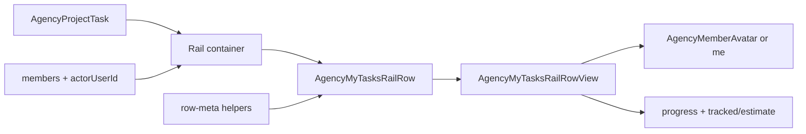

# My Tasks Row Assigner Avatar + Time Consumer Implementation Plan

> **For agentic workers:** REQUIRED SUB-SKILL: Use superpowers:subagent-driven-development (recommended) or superpowers:executing-plans to implement this plan task-by-task. Steps use checkbox (`- [ ]`) syntax for tracking.
>
> **Also persist** this plan to [`docs/superpowers/plans/2026-08-11-my-tasks-row-assigner-time-consumer.md`](docs/superpowers/plans/2026-08-11-my-tasks-row-assigner-time-consumer.md) at the start of execution (already at this path — do not recreate; only check off steps).

**Goal:** Replace My Tasks row “Assigned by {name}” with an avatar (or `me` when self-created), and replace the static estimate label with a tracked-vs-estimate time consumer that turns overdue when tracked time exceeds the estimate.

**Architecture:** Keep the golden-file row split: pure meta helpers (TDD) → rail container resolves assigner member + tracked seconds → row binder passes display-ready props → presentational row view renders avatar/`me` + consumer. Reuse `AgencyMemberAvatar` and existing `totalTrackedSeconds` on `AgencyProjectTask` (already populated by `listAgencyProjectTasks`). No API schema change.

**Tech Stack:** React 19, `AgencyMemberAvatar`, `formatEstimateMinutes`, Bun test, shadcn theme tokens (`text-error` for overdue).

## Global Constraints

- Meta line stays one quiet secondary row under the title (no new cards, no due-date overdue — this “overdue” means **over estimate**).
- Assigner source remains `task.createdByUserId` (same as today’s “Assigned by”).
- Self label is the exact word `me` (lowercase) when `createdByUserId === actorUserId`.
- Avatars use `AgencyMemberAvatar` (shared Agency treatment); size compact for the meta line (`size-3.5` / `size-4` via className override is fine).
- Time consumer uses viewer tracked time already on the task: `task.totalTrackedSeconds ?? 0` vs `task.estimateMinutes`. No new endpoint.
- Live running-timer seconds are **out of scope** for the meta consumer (mini-timer already shows live elapsed). Consumer refreshes from list/cache after entries settle.
- When there is no estimate (`null` / `0`), omit the consumer segment entirely (same as today’s omit-estimate behavior).
- Golden-file: views props-only; no oRPC/stores/session in the row view.
- Bun only: `bun test`, `bun run check`, `bun run check-types`, `bun run check:conventions`, `bun run check:golden` when adding files.

## Shape brief (locked)

| Item                    | Decision                                                                                                                                                                           |
| ----------------------- | ---------------------------------------------------------------------------------------------------------------------------------------------------------------------------------- |
| Assigner self           | Visible text `me` (no avatar required)                                                                                                                                             |
| Assigner other          | Tiny `AgencyMemberAvatar` after “Assigned by ” (no name text)                                                                                                                      |
| Assigner missing member | Fallback: no avatar; show nothing after “Assigned by ” except keep separators sensible — use muted `?` only if needed; prefer empty avatar seed via name `"Unknown"` with `userId` |
| Project                 | Unchanged: ` · {projectName}`                                                                                                                                                      |
| Consumer                | When estimate present: thin progress bar + `tracked / estimate` labels (`formatEstimateMinutes`); overdue when `trackedSeconds > estimateMinutes * 60` → `text-error` on consumer  |
| Copy                    | `Assigned by {me\|avatar} · {project}[ · consumer]`                                                                                                                                |
| A11y                    | Avatar `alt=""` decorative; wrap assigner cluster with `aria-label={`Assigned by ${name}`}` or `Assigned by me`; consumer `aria-label` includes overdue when over                  |



## File map

| File                                                                                                                                                                                     | Responsibility                                          |
| ---------------------------------------------------------------------------------------------------------------------------------------------------------------------------------------- | ------------------------------------------------------- |
| Create: [`apps/web/src/features/task-management/agency-my-tasks-row-meta.ts`](apps/web/src/features/task-management/agency-my-tasks-row-meta.ts)                                         | Pure assigner + time-consumer display models            |
| Create: [`apps/web/src/features/task-management/agency-my-tasks-row-meta.test.ts`](apps/web/src/features/task-management/agency-my-tasks-row-meta.test.ts)                               | Unit tests                                              |
| Modify: [`apps/web/src/features/task-management/my-tasks-rail/agency-my-tasks-rail-row-view.tsx`](apps/web/src/features/task-management/my-tasks-rail/agency-my-tasks-rail-row-view.tsx) | Render avatar/`me` + consumer                           |
| Modify: [`apps/web/src/features/task-management/my-tasks-rail/agency-my-tasks-rail-row.tsx`](apps/web/src/features/task-management/my-tasks-rail/agency-my-tasks-rail-row.tsx)           | Map task/member → view props via helpers                |
| Modify: [`apps/web/src/features/task-management/containers/agency-my-tasks-rail-container.tsx`](apps/web/src/features/task-management/containers/agency-my-tasks-rail-container.tsx)     | Pass member option + actorUserId instead of name string |
| Modify: [`docs/golden-file-source-inventory.md`](docs/golden-file-source-inventory.md)                                                                                                   | Via `bun scripts/generate-golden-file-inventory.mjs`    |

---

### Task 1: Pure row-meta helpers (TDD)

**Files:**

- Create: `apps/web/src/features/task-management/agency-my-tasks-row-meta.ts`
- Create: `apps/web/src/features/task-management/agency-my-tasks-row-meta.test.ts`
- Test: `apps/web/src/features/task-management/agency-my-tasks-row-meta.test.ts`

**Interfaces:**

- Consumes: `formatEstimateMinutes` from `@/features/task-management/agency-task-estimate`
- Produces:
  - `MyTasksAssignerDisplay = { kind: "me" } | { kind: "member"; userId: string; userName: string; userAvatar: string | null }`
  - `resolveMyTasksAssigner(args: { createdByUserId: string; actorUserId: string; member: { userId: string; userName: string; userAvatar: string | null } | null }): MyTasksAssignerDisplay`
  - `MyTasksTimeConsumerDisplay = { trackedLabel: string; estimateLabel: string; ratio: number; overdue: boolean; ariaLabel: string } | null`
  - `buildMyTasksTimeConsumer(args: { totalTrackedSeconds?: number | null; estimateMinutes?: number | null }): MyTasksTimeConsumerDisplay`

- [ ] **Step 1: Write the failing tests**

```typescript
import { describe, expect, test } from "bun:test";
import { buildMyTasksTimeConsumer, resolveMyTasksAssigner } from "./agency-my-tasks-row-meta";

describe("resolveMyTasksAssigner", () => {
  test("returns me when creator is the actor", () => {
    expect(
      resolveMyTasksAssigner({
        createdByUserId: "u1",
        actorUserId: "u1",
        member: { userId: "u1", userName: "Omar", userAvatar: null },
      }),
    ).toEqual({ kind: "me" });
  });

  test("returns member when creator is someone else", () => {
    expect(
      resolveMyTasksAssigner({
        createdByUserId: "u2",
        actorUserId: "u1",
        member: { userId: "u2", userName: "Sam", userAvatar: "https://x/a.png" },
      }),
    ).toEqual({
      kind: "member",
      userId: "u2",
      userName: "Sam",
      userAvatar: "https://x/a.png",
    });
  });

  test("falls back to Unknown member when lookup missing", () => {
    expect(
      resolveMyTasksAssigner({
        createdByUserId: "u9",
        actorUserId: "u1",
        member: null,
      }),
    ).toEqual({
      kind: "member",
      userId: "u9",
      userName: "Unknown",
      userAvatar: null,
    });
  });
});

describe("buildMyTasksTimeConsumer", () => {
  test("returns null without estimate", () => {
    expect(buildMyTasksTimeConsumer({ totalTrackedSeconds: 3600, estimateMinutes: null })).toBe(
      null,
    );
    expect(buildMyTasksTimeConsumer({ totalTrackedSeconds: 3600, estimateMinutes: 0 })).toBe(null);
  });

  test("formats tracked/estimate and clamps ratio to 0..1 for the bar", () => {
    expect(buildMyTasksTimeConsumer({ totalTrackedSeconds: 3600, estimateMinutes: 240 })).toEqual({
      trackedLabel: "1h",
      estimateLabel: "4h",
      ratio: 0.25,
      overdue: false,
      ariaLabel: "1h of 4h estimated",
    });
  });

  test("marks overdue when tracked exceeds estimate and caps bar ratio at 1", () => {
    expect(
      buildMyTasksTimeConsumer({ totalTrackedSeconds: 5 * 3600, estimateMinutes: 240 }),
    ).toEqual({
      trackedLabel: "5h",
      estimateLabel: "4h",
      ratio: 1,
      overdue: true,
      ariaLabel: "5h of 4h estimated, over estimate",
    });
  });

  test("treats missing tracked as zero", () => {
    expect(buildMyTasksTimeConsumer({ estimateMinutes: 60 })).toEqual({
      trackedLabel: "0m",
      estimateLabel: "1h",
      ratio: 0,
      overdue: false,
      ariaLabel: "0m of 1h estimated",
    });
  });
});
```

- [ ] **Step 2: Run tests — expect FAIL**

```bash
bun test apps/web/src/features/task-management/agency-my-tasks-row-meta.test.ts
```

Expected: module not found / fail.

- [ ] **Step 3: Minimal implementation**

```typescript
import { formatEstimateMinutes } from "@/features/task-management/agency-task-estimate";

export type MyTasksAssignerDisplay =
  | { kind: "me" }
  | { kind: "member"; userId: string; userName: string; userAvatar: string | null };

export function resolveMyTasksAssigner(args: {
  createdByUserId: string;
  actorUserId: string;
  member: { userId: string; userName: string; userAvatar: string | null } | null;
}): MyTasksAssignerDisplay {
  if (args.createdByUserId && args.createdByUserId === args.actorUserId) {
    return { kind: "me" };
  }
  if (args.member) {
    return {
      kind: "member",
      userId: args.member.userId,
      userName: args.member.userName,
      userAvatar: args.member.userAvatar,
    };
  }
  return {
    kind: "member",
    userId: args.createdByUserId,
    userName: "Unknown",
    userAvatar: null,
  };
}

export type MyTasksTimeConsumerDisplay = {
  trackedLabel: string;
  estimateLabel: string;
  ratio: number;
  overdue: boolean;
  ariaLabel: string;
};

export function buildMyTasksTimeConsumer(args: {
  totalTrackedSeconds?: number | null;
  estimateMinutes?: number | null;
}): MyTasksTimeConsumerDisplay | null {
  const estimateMinutes = args.estimateMinutes ?? null;
  if (estimateMinutes === null || estimateMinutes <= 0) return null;

  const trackedSeconds = Math.max(0, Math.floor(args.totalTrackedSeconds ?? 0));
  const estimateSeconds = estimateMinutes * 60;
  const trackedMinutes = Math.floor(trackedSeconds / 60);
  const overdue = trackedSeconds > estimateSeconds;
  const ratio = Math.min(1, trackedSeconds / estimateSeconds);
  const trackedLabel = formatEstimateMinutes(trackedMinutes);
  const estimateLabel = formatEstimateMinutes(estimateMinutes);
  const ariaLabel = overdue
    ? `${trackedLabel} of ${estimateLabel} estimated, over estimate`
    : `${trackedLabel} of ${estimateLabel} estimated`;

  return { trackedLabel, estimateLabel, ratio, overdue, ariaLabel };
}
```

- [ ] **Step 4: Run tests — expect PASS**

```bash
bun test apps/web/src/features/task-management/agency-my-tasks-row-meta.test.ts
```

Expected: PASS.

- [ ] **Step 5: Commit**

```bash
git add apps/web/src/features/task-management/agency-my-tasks-row-meta.ts \
  apps/web/src/features/task-management/agency-my-tasks-row-meta.test.ts
git commit -m "$(cat <<'EOF'
feat(task-management): add My Tasks assigner and time-consumer helpers

EOF
)"
```

---

### Task 2: Presentational row meta UI

**Files:**

- Modify: `apps/web/src/features/task-management/my-tasks-rail/agency-my-tasks-rail-row-view.tsx`

**Interfaces:**

- Consumes: `MyTasksAssignerDisplay`, `MyTasksTimeConsumerDisplay` from Task 1; `AgencyMemberAvatar`
- Produces: updated props — replace `assignedByLabel: string` + raw `estimateMinutes` with `assigner` + `timeConsumer`

- [ ] **Step 1: Replace props and meta line**

In `agency-my-tasks-rail-row-view.tsx`:

1. Remove imports of `formatEstimateMinutes` and props `assignedByLabel` / `estimateMinutes`.
2. Add:

```typescript
import { AgencyMemberAvatar } from "@/features/shared/agency-member-avatar";
import type {
  MyTasksAssignerDisplay,
  MyTasksTimeConsumerDisplay,
} from "@/features/task-management/agency-my-tasks-row-meta";

type AgencyMyTasksRailRowViewProps = {
  // ...existing props except assignedByLabel / estimateMinutes...
  assigner: MyTasksAssignerDisplay;
  timeConsumer: MyTasksTimeConsumerDisplay | null;
};
```

3. Replace the secondary meta `motion.div` children with:

```tsx
<span className="inline-flex min-w-0 items-center gap-1">
  <span className="shrink-0">Assigned by</span>
  {assigner.kind === "me" ? (
    <span className="shrink-0">me</span>
  ) : (
    <span
      className="inline-flex shrink-0 items-center"
      aria-label={`Assigned by ${assigner.userName}`}
    >
      <AgencyMemberAvatar
        name={assigner.userName}
        userId={assigner.userId}
        avatarUrl={assigner.userAvatar}
        size="sm"
        className="size-3.5 rounded-full"
      />
    </span>
  )}
  <span className="min-w-0 truncate">· {projectName}</span>
  {timeConsumer ? (
    <span
      className={cn(
        "inline-flex shrink-0 items-center gap-1",
        timeConsumer.overdue ? "text-error" : "text-muted",
      )}
      aria-label={timeConsumer.ariaLabel}
    >
      <span aria-hidden>·</span>
      <span className="relative h-1 w-8 overflow-hidden rounded-full bg-muted" aria-hidden>
        <span
          className={cn(
            "absolute inset-y-0 left-0 rounded-full",
            timeConsumer.overdue ? "bg-error" : "bg-primary",
          )}
          style={{ width: `${Math.round(timeConsumer.ratio * 100)}%` }}
        />
      </span>
      <span className="font-mono tabular-nums">
        {timeConsumer.trackedLabel}/{timeConsumer.estimateLabel}
      </span>
    </span>
  ) : null}
</span>
```

Keep the outer `motion.div` class `mt-0.5 truncate text-xs text-muted` — overdue segment overrides color locally via `text-error`.

- [ ] **Step 2: Typecheck the view file in context**

```bash
bun run check-types
```

Expected: failures only in row/container call sites still passing old props (fixed in Task 3). If the view alone typechecks via turbo, proceed.

- [ ] **Step 3: Commit**

```bash
git add apps/web/src/features/task-management/my-tasks-rail/agency-my-tasks-rail-row-view.tsx
git commit -m "$(cat <<'EOF'
feat(task-management): render My Tasks assigner avatar and time consumer

EOF
)"
```

---

### Task 3: Wire container + row binder

**Files:**

- Modify: `apps/web/src/features/task-management/my-tasks-rail/agency-my-tasks-rail-row.tsx`
- Modify: `apps/web/src/features/task-management/containers/agency-my-tasks-rail-container.tsx`
- Modify: `docs/golden-file-source-inventory.md` (regenerate)

**Interfaces:**

- Consumes: `resolveMyTasksAssigner`, `buildMyTasksTimeConsumer`, `view.actorUserId`, `view.members`, `task.createdByUserId`, `task.totalTrackedSeconds`, `task.estimateMinutes`
- Produces: row receives `assigner` + `timeConsumer` instead of `assignedByLabel`

- [ ] **Step 1: Update row binder props**

Replace `assignedByLabel: string` with member lookup inputs, or pass already-resolved display models from the container. Prefer resolving in the binder so the container stays thin:

```typescript
import {
  buildMyTasksTimeConsumer,
  resolveMyTasksAssigner,
  type MyTasksAssignerDisplay,
} from "@/features/task-management/agency-my-tasks-row-meta";
import type { AgencyMemberOption } from "@/features/shared/agency-member-option";

type AgencyMyTasksRailRowProps = {
  task: AgencyProjectTask;
  view: AgencyMyTasksRailViewModel;
  projectName: string;
  assignerMember: AgencyMemberOption | null;
  variants: Variants;
  stagger: number;
};

// inside component:
const assigner: MyTasksAssignerDisplay = resolveMyTasksAssigner({
  createdByUserId: task.createdByUserId,
  actorUserId: view.actorUserId,
  member: assignerMember,
});
const timeConsumer = buildMyTasksTimeConsumer({
  totalTrackedSeconds: task.totalTrackedSeconds,
  estimateMinutes: task.estimateMinutes,
});

// pass assigner + timeConsumer to AgencyMyTasksRailRowView (drop assignedByLabel / estimateMinutes)
```

- [ ] **Step 2: Update rail container**

Replace name-only lookup:

```tsx
const assignerMember =
  view.members.find((member) => member.userId === task.createdByUserId) ?? null;

return (
  <AgencyMyTasksRailRow
    key={task.id}
    task={task}
    view={view}
    projectName={project?.name ?? "Project"}
    assignerMember={assignerMember}
    variants={railListItemVariants}
    stagger={stagger}
  />
);
```

Remove `assignedByLabel` / `memberNameById` usage from this map (keep `memberNameById` on the ViewModel if still used elsewhere; if unused after this change, leave the VM field alone unless nothing references it — do not delete unused VM fields in this task unless `check`/`oxlint` requires it).

- [ ] **Step 3: Regenerate golden inventory + verify**

```bash
bun scripts/generate-golden-file-inventory.mjs
bun test apps/web/src/features/task-management/agency-my-tasks-row-meta.test.ts
bun run check
bun run check-types
bun run check:conventions
bun run check:golden
```

Expected: all pass.

Manual: Tracker → My Tasks → row created by you shows `Assigned by me · Project · 0m/4h` (if estimated); row created by teammate shows avatar not name; force tracked > estimate (or use a task with known overage) → consumer uses error color and aria “over estimate”.

- [ ] **Step 4: Commit**

```bash
git add apps/web/src/features/task-management/my-tasks-rail/agency-my-tasks-rail-row.tsx \
  apps/web/src/features/task-management/containers/agency-my-tasks-rail-container.tsx \
  docs/golden-file-source-inventory.md
git commit -m "$(cat <<'EOF'
feat(task-management): wire My Tasks assigner avatar and time consumer

EOF
)"
```

---

## Self-review

1. **Spec coverage:** Avatars instead of names → Task 2/3; `me` for self → Task 1/2; time consumer + overdue (over estimate) → Task 1/2/3; uses existing `totalTrackedSeconds` — no API work.
2. **Placeholder scan:** No TBD/TODO; helpers, view JSX, wire steps are concrete.
3. **Type consistency:** `MyTasksAssignerDisplay` / `MyTasksTimeConsumerDisplay` names match across tasks; row drops `assignedByLabel`/`estimateMinutes` in favor of `assigner`/`timeConsumer`.

## Out of scope

- Live running-timer inclusion in the consumer bar
- Due-date overdue (task list already has that elsewhere)
- Changing assigner semantics from `createdByUserId` to assignees
- Moving estimate editing UI
- New API fields
