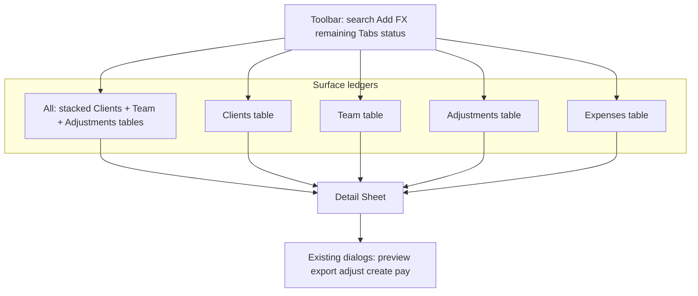

# Bills tables redesign

I'm using the writing-plans skill to create the implementation plan. Impeccable `shape` is Operate mode inside the established DESIGN.md world (quiet instrument, shadcn tokens). Open Design was unavailable (MCP discovery error); Design Inspiration (Linear-grade dense tables, right-aligned money, sparse accent) is used as craft reference, not a new visual identity.

**Locked decisions from discovery**
- One dedicated table per surface, with columns that fit that surface
- Row click opens a detail sheet; the table stays dense; actions live in the sheet
- Reimagine the whole Bills section (header, remaining, filters, and list)

**Visitor mode:** Operate. Owners/managers settle period money under time pressure. Success is: scan remaining, open the right party, Collect/Pay/Export without hunting icon buttons or parsing a truncated meta rail.

---

## Shape brief (confirm this)

**Job.** Period close: who still owes, who is ready to export, what to Collect/Pay.

**Outcome.** Remaining is the north-star. Each surface is a comparable ledger. Carry is visible as a count, inspected in the sheet. Primary CTA in the sheet footer matches the party (Collect vs Pay vs Pay expense).

**Selected direction (structural, not a new world).** Ledger + inspector.
- Toolbar is a command bar, not a second hero
- Party Tabs swap the ledger (All stacks the surface tables that have rows)
- Status is one optional filter, not a competing pill row
- Table is the work surface; Sheet is the action surface
- Existing preview/export/adjust/create **dialogs stay** and are opened from the sheet (no second implementation of compose)

**Anti-goals.** No API/schema change. No new Expenses page. No nested dashed carry rows in the table. No icon-only row actions. No DESIGN.md rewrite. No nested cards. No liquid glass. No semantic coloring of amounts except warning when remaining > 0. Do not auto-unwaste or change waste math.

**States.** Loading = header + skeleton table. Error = retry. Empty = surface-specific copy + one CTA. Overflow = horizontal scroll (`min-w` like Reports). Sheet closed vs open (selected row highlighted). Mutation pending disables sheet CTAs.

---

## Growth + dashboard findings that drive the UI

Current instrument rows fail scan: Total/Received/Waste live in truncated prose; Preview/Adjust are unlabeled icons; Remaining is duplicated as panel hero and per-row gold; two pill rows plus External add Hick's Law load.

C.L.E.A.R. on the incumbent (section as used today): Copy 3, Layout 2, Emphasis 2, A11y 3, Reward 2 = **12/25**. The table+sheet design targets Layout/Emphasis/Act first.

Dashboard rules applied: north-star remaining at top; numbers right-aligned tabular; chips/avatars for party+status; color only for open remaining and Ready-to-act; secondary actions progressive-disclosed in the sheet.

Cognitive walkthrough (proposed, owner persona, start = Money > Bills):
- Filter to Clients: Tabs are labeled and selected state is obvious
- Open a client: whole row is the hit target; name is also a party link (stopPropagation)
- Collect/Export: sheet footer is the primary action; progress is the existing dialog then live row update
- Prior carry: Carry column chip; lines listed in the sheet (not nested table rows)
- Pay a due expense: Expenses table + sheet sticky Pay (same path as Collect, not a special icon)

---

## Interaction topology

**All** never mixes kinds in one grid. It renders the same three tables as the dedicated surfaces, skipping empty ones, each with a quiet section title + count. Expenses stays a party Tab (product rule: expenses live inside Bills).

---

## Chrome (whole section)

Reuse [`money-panel-chrome.tsx`](apps/web/src/features/money/money-panel-chrome.tsx) pieces, restacked:

1. **Title row:** Bills/Expenses · search (`AgencySearchHighlight` still used in cells) · count · Add dropdown (Invoice / Adjustment / Expense — unchanged)
2. **FX line:** keep `MoneyPeriodFxLine`
3. **North-star strip:** Remaining (or Period spend on Expenses) + insight (`10 accounts still open · 13 ready to export`) on one row. Smaller than today's metric block; the table Remaining column is the per-row truth
4. **Party:** shadcn `Tabs` (All / Clients / Team / Adjustments / Expenses), not a second pill aesthetic competing with status
5. **Status:** one `Select` or compact filter next to search ("All statuses" / Paid / Partial / Outstanding). External remains a dismissible chip under the toolbar when All or Clients

Mobile: search full width; Tabs scroll; tables `overflow-x-auto`; sheet `side="bottom"` below `sm`, `side="right"` and wider than default `sm:max-w-sm` (override to ~32rem) on desktop.

---

## Columns per surface

Numeric cells: `font-mono tabular-nums text-right`. Status: shadcn `Badge`. Waste column omitted when every row in that table has waste = 0.

**Clients** (one row = `MoneyBillPersonGroup` party client)
- Party (hue initials + name; name links to client)
- Status
- Period (current line range; mixed → em dash range or "Mixed")
- Carry (quiet "Prior" chip + count, or empty)
- Total, Received, Waste?, Remaining

**Team** (one row = person-group party team)
- Member (`AgencyMemberAvatar` + name; name links to profile)
- Status
- Period
- Carry
- Total, Paid (same cents as received), Waste?, Remaining
- Salary pool: pinned first row or `TableFooter` labeled "Team salaries" with total/paid/remaining; click opens the same sheet with Pay (no separate card panel)

**Adjustments**
- Title, Type (`sectionTitle`: PBC / Charity / Debt), Status, Period, Amount, Paid, Remaining

**Expenses** (replace strip rows in [`agency-money-expenses-section-view.tsx`](apps/web/src/features/money/agency-money-expenses-section-view.tsx))
- Glyph + name, Kind, Status, Due/meta, Amount, Remaining
- Urgency sort unchanged. Neutral glyphs unchanged (no colored type dots)

---

## Detail sheet (new)

New presentational view. Hook owns `selectedBillId` / `selectedExpenseId`.

**Header.** Party identity, status, remaining (warning if open).

**Body.** Mini line ledger: current then carry (`isCarry`), each with period, total, received/paid, remaining. This is where nested carry moves.

**Sticky footer (one primary).**
- Client: Collect (opens existing adjust dialog, Collect tab)
- Team: Pay
- Ready: copy stays "export then pay" via existing adjust flow
- Adjustment: Record payment / Mark paid; Dismiss secondary
- Expense due: Pay / Record

Secondary text buttons: Preview invoice/payslip, Export (opens existing preview dialog which already has combine/split + Export). Party profile/client link.

Do not duplicate compose logic. Sheet only selects the group/line then calls existing `onOpenPreview`, `onOpenAdjust`, `onOpenPayment`, expense pay/edit.

Row keyboard: `Enter`/`Space` opens sheet. Identity link is a nested `<a>` with click stopPropagation.

---

## Files (golden-file: views + hook only)

No router/service/schema work.

**Modify**
- [`apps/web/src/features/money/agency-money-bills-section-view.tsx`](apps/web/src/features/money/agency-money-bills-section-view.tsx) — replace instrument list with chrome + table mount; delete `BillPersonGroupCard` / `BillObligationLineRow` / `BillAdjustmentRow` / `SalaryPoolPanel` from this file
- [`apps/web/src/features/money/agency-money-expenses-section-view.tsx`](apps/web/src/features/money/agency-money-expenses-section-view.tsx) — `MoneyExpensesPanelContent` becomes a table; keep existing expense dialogs
- [`apps/web/src/features/money/hooks/use-agency-money-bills.ts`](apps/web/src/features/money/hooks/use-agency-money-bills.ts) — sheet selection state; wire existing open-preview/adjust handlers
- [`apps/web/src/features/money/hooks/use-agency-money-expenses-panel.ts`](apps/web/src/features/money/hooks/use-agency-money-expenses-panel.ts) — selected expense for sheet if not already covered
- [`apps/web/src/features/money/money-panel-chrome.tsx`](apps/web/src/features/money/money-panel-chrome.tsx) — only if the north-star strip needs a slimmer metric variant; prefer composing existing exports first

**Create**
- `apps/web/src/features/money/agency-money-bills-tables-view.tsx` — four table presentational components + All stack
- `apps/web/src/features/money/agency-money-bill-detail-sheet-view.tsx` — sheet chrome + line list + footer CTAs
- `apps/web/src/features/billing/money-bills-table-columns.ts` — pure helpers: waste-column visibility, carry count, period label for a group (test this)

**Reuse, do not rewrite**
- [`apps/web/src/ui/table.tsx`](apps/web/src/ui/table.tsx), [`apps/web/src/ui/sheet.tsx`](apps/web/src/ui/sheet.tsx), Tabs/Select/Badge/Button
- Reports overflow pattern: `overflow-x-auto rounded-dense border` + `Table` `min-w-[48rem]` from [`agency-reports-table.tsx`](apps/web/src/features/reports/agency-reports-table.tsx)
- [`agency-money-bills-dialogs-view.tsx`](apps/web/src/features/money/agency-money-bills-dialogs-view.tsx)
- [`money-bill-obligation-rows.ts`](apps/web/src/features/billing/money-bill-obligation-rows.ts) grouping

**Tests**
- Unit: `money-bills-table-columns.test.ts` (waste column, carry count, mixed period)
- Existing filter/obligation tests must still pass
- No new API Bruno tests

**Done checks:** `bun run check`, `bun run check-types`, `bun run check:conventions`, browser pass on Money > Bills (All, Clients, Team, Adjustments, Expenses; open sheet; Collect/Pay/Preview still work; External chip; salary pool; empty/error).

---

## Implementation tasks

### Task 1: Column helpers

**Files:** Create `apps/web/src/features/billing/money-bills-table-columns.ts` + test.

Helpers (pure, no React):
- `moneyBillGroupCarryCount(group)` → number of `isCarry` lines
- `moneyBillGroupPeriodLabel(group)` → formatted range or Mixed
- `moneyBillTableShowsWaste(rows)` → true if any `wasteAmount > 0`

TDD: write failing tests, then implement. Commit: `feat: add bills table column helpers`

### Task 2: Tables view

**Files:** Create `agency-money-bills-tables-view.tsx`. Modify section view to mount it.

Presentational props only (groups, adjustments, salary pool VM, searchTerm, pending, callbacks: `onOpenRow`, `onOpenParty`). shadcn `Table` matching Reports density. All stacks Clients/Team/Adjustments. Loading skeleton and empty stay in the section view.

### Task 3: Detail sheet

**Files:** Create `agency-money-bill-detail-sheet-view.tsx`. Extend `use-agency-money-bills.ts` with selected group/adjustment id.

Sheet lists lines (carry included). Footer calls existing preview/adjust/payment/dismiss. Override Sheet width. `prefers-reduced-motion` already on Sheet primitives.

### Task 4: Chrome restack

**Files:** `agency-money-bills-section-view.tsx`, optionally `money-panel-chrome.tsx`.

Party → Tabs. Status → Select. Remaining strip compacted. Keep Add menu, FX, External chip, search.

### Task 5: Expenses table + sheet

**Files:** `agency-money-expenses-section-view.tsx`, expenses hook if needed.

Same table grammar. Row click opens sheet; Pay is the sticky primary. Keep create/edit/payment dialogs.

### Task 6: Verify

Browser: all five party Tabs, status filter, External dismiss, carry chip → sheet lines, Collect/Pay/Preview/Export, salary pool, expense Pay, empty search, loading/error. Then `bun run check`, `check-types`, `check:conventions`.
